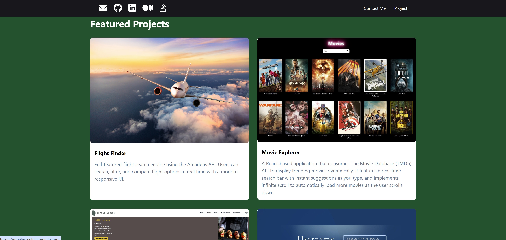

https://yeinier-personal-portfolio.netlify.app/

## Environment Variables

Create a `.env` file for local development with:

```env
REACT_APP_EMAILJS_PUBLIC_KEY=your_public_key
REACT_APP_EMAILJS_SERVICE_ID=your_service_id
REACT_APP_EMAILJS_TEMPLATE_ID=your_template_id
```

For Netlify, add the same three variables in Site configuration -> Environment variables.

## 💼 Developer Portfolio

A modern single-page React portfolio showcasing personal projects and a contact form. The layout includes full-screen sections, a featured projects area, and a responsive design powered by Chakra UI.

## 📌 Description

This project displays a developer's portfolio with several featured projects, contact information, and dynamic UI behavior. One of the key highlights is a Formik-powered contact form with Chakra UI components and real-time validation.

## ✨ Features

🎯 Single Page Application layout

🌄 Fullscreen welcome/landing section

📸 Project showcase with images and descriptions

📨 Contact form with Formik and Chakra UI validation

📱 Responsive design for desktop and mobile

🎨 Styled with Chakra UI and custom context/hooks for logic

## 🚀 Getting Started
```
git clone https://github.com/Yeinier22/personal-website.git
cd portfolio
npm install
npm start
```
The app will run on http://localhost:3000.

## 📁 Project Structure
```
/src
  ├── components        # UI components (Card, Header, ProjectsSection...)
  ├── context           # Global context for theme/data
  ├── hooks             # Custom hooks
  ├── images            # Static images
  └── App.js, App.css    # Main entry
```

## 🧪 Contact Form Validation

Built using Formik and Chakra UI

Real-time feedback (required fields, email format, etc.)

Accessible UI and alert component feedback on submit

## 📷 Screenshots


Hero section with dark background and call to action

Projects grid with "Flight Finder," "Movie Explorer," and more

Contact form demo with validation alerts

Mobile-friendly layout (burger menu, stacking components)

## 📚 Credits

UI based on Coursera's Meta Front-End Developer Capstone design

Icons from Font Awesome

Chakra UI for base styling

✅ Great for demonstrating real-world React patterns, Chakra integration, and clean UI design with validation and layout control.
